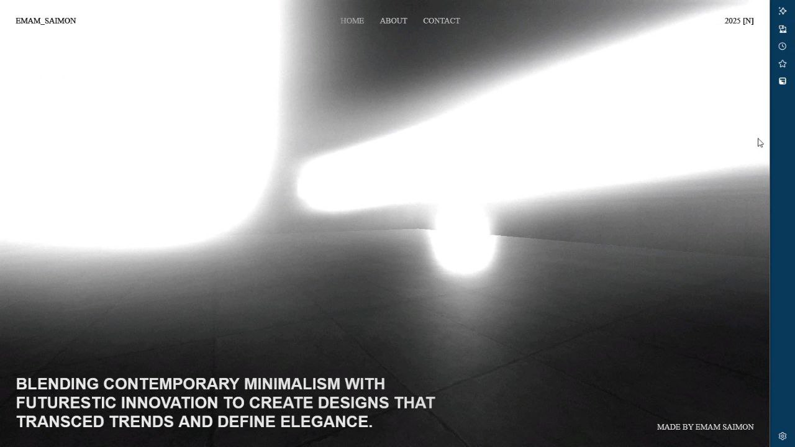

#  Three.js 3D Scene with Vite

This project is a simple and efficient 3D scene built using [Three.js](https://threejs.org/) and powered by [Vite](https://vitejs.dev/) for fast development and bundling....

## 📸 Preview

<p align="center">
  <table align="center">
    <tr>
      <td> &nbsp;&nbsp;&nbsp;</td>
      <td>&nbsp;&nbsp;&nbsp;</td>
      <td> &nbsp;&nbsp;&nbsp;</td>
    </tr>
  </table>
</p>


##  Features

-  Real-time 3D rendering with Three.js
-  Lightning-fast development with Vite
-  Modular and maintainable code structure
-  Responsive rendering and animation loop


## Installation

```bash
# Clone the repository
git clone https://github.com/EmamSaimon592/threejs-3d-scene.git

# Navigate into the project directory
cd threejs-vite-3d-scene

# Install dependencies
npm install

```
##  Development

To start a local dev server with hot reload:

```bash
 npm run dev
```
##  Deploy

You can deploy the dist/ folder to any static hosting service like GitHub Pages, Netlify, Vercel, etc.

##  Dependencies

 1.Three.js
 2. vite

## Author

Imam Hossain
